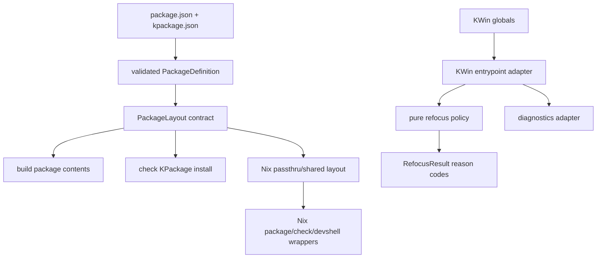

# Design Review: Correct End State

<!-- SPDX-FileCopyrightText: 2026 KIM Hyunjae -->
<!-- SPDX-License-Identifier: AGPL-3.0-or-later -->

## Executive Summary

No P0 production-risk issue was found in this review. The current program is intentionally small and the user-facing refocus behavior is mostly well characterized, but the design has several P1 risks around ownership boundaries: package layout policy is duplicated across JavaScript, Nix, embedded shell, Just recipes, tests, and docs; refocus policy is interleaved with live KWin workspace mutation; and startup/package failure paths do not expose enough structured information to debug real failures.

The correct end state should keep the architecture boring and narrow. The refocus domain should own pure eligibility/capture/restore decisions and return internal result semantics; KWin entrypoint code should own global APIs, workspace mutation, shortcut registration, and diagnostics. Package manifests should be parsed into one validated package contract, package layout should be derived from that contract, and Nix/shell wrappers should consume shared derived values instead of reconstructing path policy. Tests should separate pure logic, KWin adapter behavior, and generated package integration.

## Top Design Risks

1. **Package layout and KPackage identity are not owned by one contract.** `scripts/package-layout.mjs`, `scripts/package-operations.mjs`, `nix/module/package.nix`, `nix/module/checks.nix`, `nix/module/devshell.nix`, `justfile`, `tests/package.test.ts`, and `README.md` all encode parts of the package type, install paths, archive paths, metadata name, or `contents/` layout.
2. **Refocus policy and live KWin effects are interleaved.** `recoverImeFocus` both decides eligibility and mutates `workspace.activeWindow`, so a reader must understand KWin side effects during focus clearing to reason about policy correctness.
3. **The KWin entrypoint is hidden behind globals and text-based tests.** `src/main.ts` immediately registers a shortcut through global APIs, ignores registration failure, and tests assert registration/delegation through regexes over generated JavaScript rather than semantic callback behavior.
4. **Operational errors are too collapsed.** `registerShortcut` failure is ignored, `kpackagetool6` failure is represented mostly as an exit code, manifest validation lacks source context, and cleanup can mask the primary package-check failure.
5. **Test seams are coupled to generated artifacts and duplicated contracts.** Refocus tests load `build/src/main.js` through `node:vm`, test fixtures duplicate the KWin API shape, package tests mix unit logic with generated artifact checks, and wildcard `.mjs` declarations blur script module boundaries.

## Single Source of Truth Violations

### Finding: KPackage layout contract is duplicated across build layers

#### Evidence

- `kpackage.json:2` declares `KPackageStructure` as `KWin/Script`, and `kpackage.json:15-16` declares the Plasma API and main script path.
- `scripts/package-layout.mjs:8-30` defines `contents`, `metadata.json`, and installed paths under `dataHome/kwin/scripts/<pluginId>`.
- `scripts/package-layout.mjs:33-55` defines `build/src/main.js`, `dist/<packageName>/contents/<mainScriptRelativePath>`, and `dist/<packageName>/metadata.json`.
- `scripts/package-operations.mjs:61-81` hard-codes `kpackagetool6 --type=KWin/Script`, then validates installed paths through `createInstalledPackageLayout`.
- `nix/module/package.nix:9-13` separately reads `package.json` and `kpackage.json`, `nix/module/package.nix:44-54` rebuilds and installs from `dist/${packageJson.name}` into `$out/share/kwin/scripts/${pluginId}`, and `nix/module/package.nix:59-67` exposes only some derived values as passthru.
- `nix/module/checks.nix:45-47` independently checks `$packageRoot/metadata.json` and `$packageRoot/contents/${package.mainScriptRelativePath}`.
- `nix/module/devshell.nix:44-58` derives plugin/package/archive values, and `nix/module/devshell.nix:76-88` stages an archive and checks installed `metadata.json` plus `contents/${package.mainScriptRelativePath}`.
- `justfile:10-13` repeats package/check attribute names, and `justfile:27-37` repeats the source build/package/check flow.

#### Current state

The package contract is spread across manifest data, Node scripts, Nix modules, embedded shell text, Just recipes, and tests. JavaScript owns local `dist/` generation and temporary install layout; Nix independently owns derivation installation, checks, and archive creation flow.

#### Design concern

Changing `KPackageStructure`, plugin ID, install root, metadata filename, `contents/` placement, main script path semantics, or archive naming requires coordinated edits across several layers. The design does not make it clear whether JavaScript packaging code, Nix packaging code, or the manifest is authoritative.

#### Correct end state

`package.json` and `kpackage.json` should be the source data. `scripts/package-manifest.mjs` should parse and validate that data into a package contract, including `packageName`, `version`, `license`, `pluginId`, `packageStructure`, `plasmaApi`, and `mainScriptRelativePath`. `scripts/package-layout.mjs` should own JavaScript-side generated layout and operation plans. Nix should centralize Nix-side installed layout once, preferably through package `passthru` fields or a small shared Nix helper consumed by `package.nix`, `checks.nix`, and `devshell.nix`.

#### Suggested migration

1. Extend the package definition with validated `packageStructure` and `plasmaApi`.
2. Add derived layout/passthru values for installed root, metadata path, main script path, and archive name.
3. Update `scripts/package-operations.mjs`, `nix/module/checks.nix`, and `nix/module/devshell.nix` to consume derived values rather than recomposing paths.
4. Keep Just as a thin command surface and avoid embedding package policy there.
5. Add tests that prove changing `X-Plasma-MainScript` and `KPlugin.Id` flows through the one package contract.

#### Acceptance criteria

- `KWin/Script`, `contents`, `metadata.json`, `share/kwin/scripts`, and archive naming are implemented once per explicit layer boundary.
- JavaScript package operations consume package contract/layout values rather than hard-coded KPackage type strings.
- Nix package, check, and devshell code reuse shared derived layout values.
- Changing `X-Plasma-MainScript` or `KPlugin.Id` requires manifest and test updates, not multiple independent path formulas.

#### Priority

P1

### Finding: KWin runtime shapes are duplicated in the test harness

#### Evidence

- `src/kwin.d.ts:4-25` declares `KWinVirtualDesktop`, `KWinWindow`, and `KWinWorkspace`.
- `src/kwin.d.ts:29-34` declares `registerShortcut`.
- `tests/support/refocus-harness.ts:7-29` separately declares `DesktopFixture`, `WindowFixture`, and `WorkspaceFixture` with overlapping fields.
- `tests/support/refocus-harness.ts:36-58` declares a separate `RefocusApi` matching the exported global namespace.
- `tests/support/refocus-harness.ts:88-105` creates a default eligible window that mirrors the assumptions consumed by `src/refocus.ts:39-56`.
- `tests/tsconfig.json:9-10` includes test files and `node.d.ts`, but does not include `src/kwin.d.ts` as a shared contract.

#### Current state

Production code relies on ambient KWin declarations in `src/kwin.d.ts`, while tests use a parallel fixture model with the same fields under different names. The two shapes can drift independently.

#### Design concern

The KWin adapter boundary is owned twice. If a consumed KWin field changes in production declarations, TypeScript does not force fixture updates. If the harness changes mutability or default state, tests may validate behavior against a hand-copied model instead of the declared runtime contract.

#### Correct end state

`src/kwin.d.ts` should be the authoritative local model of the KWin API surface used by this package. Tests should reuse or extend `KWinVirtualDesktop`, `KWinWindow`, `KWinWorkspace`, and the shortcut function shape. Harness-only behavior such as `assignments` and setter callbacks should live in narrow test extensions around the shared contract.

#### Suggested migration

1. Include the production KWin declarations in the test TypeScript configuration.
2. Replace duplicated fixture interfaces with aliases or extensions of the production declarations.
3. Keep `assignments` and `onActiveWindowSet` as harness-owned test behavior.
4. Keep the sandbox shortcut signature tied to the shared declaration.

#### Acceptance criteria

- KWin desktop/window/workspace/shortcut shapes are declared once.
- A change to a consumed `KWinWindow` field creates type-checking consequences in runtime code and tests.
- `createWindow` returns a value compatible with `KWinWindow` without a separate full field-list interface.
- Harness-only state is clearly separated from the KWin API shape.

#### Priority

P2

### Finding: Shortcut action identity is repeated across runtime, metadata, tests, and docs

#### Evidence

- `src/main.ts:5-11` calls `registerShortcut("IME Refocus", "Recover IME focus for the active window", "", ...)`.
- `kpackage.json:10` declares `KPlugin.Description`.
- `kpackage.json:13` declares `KPlugin.Name` as `IME Refocus`.
- `tests/package.test.ts:403-410` asserts the shortcut strings through regexes over the packaged script.
- `README.md:37` and `README.md:43` refer to enabling/finding `IME Refocus`.
- `docs/spec/SPEC.md:34-35` specifies that the shortcut user-visible name identifies it as an IME refocus or recovery action.

#### Current state

The runtime shortcut title, runtime shortcut description, plugin name, plugin description, tests, README, and spec all describe the same visible action, but the runtime values are hard-coded in `src/main.ts` and repeated in tests/docs.

#### Design concern

Visible action identity can drift. For example, `KPlugin.Name` could change while the shortcut title remains unchanged, or tests could preserve old strings even if product naming intentionally changes.

#### Correct end state

Runtime shortcut title, description, and default binding should be defined once in an action metadata definition. The intended relationship between `KPlugin.Name` and the shortcut title should be explicit: either tested as intentionally matching, or documented as intentionally separate.

#### Suggested migration

1. Introduce a small action metadata constant for shortcut title, description, and default key sequence.
2. Update `src/main.ts` to use that metadata.
3. Replace source-text string assertions with semantic registration tests that compare against the metadata.
4. Decide whether plugin name and shortcut title must match, then encode only that intended relationship.

#### Acceptance criteria

- Runtime shortcut title, description, and default binding are defined once for runtime code.
- Tests do not duplicate shortcut strings as independent expected values.
- The relationship between `KPlugin.Name` and shortcut title is explicit.

#### Priority

P3

## Invariant and Correctness Risks

### Finding: Package manifest identity is only partially validated

#### Evidence

- `kpackage.json:2` declares `KPackageStructure` as `KWin/Script`.
- `kpackage.json:15` declares `X-Plasma-API` as `javascript`.
- `scripts/package-manifest.mjs:43-63` validates `KPlugin`, package name, plugin ID, package license/version, and `X-Plasma-MainScript`, but not `KPackageStructure` or `X-Plasma-API`.
- `tests/package.test.ts:30-59` names the behavior as manifest validation but only checks derived metadata for a valid fixture.
- `tests/package.test.ts:381-393` checks that build output copies `KPackageStructure`, `X-Plasma-API`, and `X-Plasma-MainScript` from the source manifest, not that invalid identity values are rejected.

#### Current state

`createPackageDefinition` can produce a package definition for a manifest that is not a KWin JavaScript script. Later package operations may still use `kpackagetool6 --type=KWin/Script`, so an invalid manifest can flow deeper into the build/check path.

#### Design concern

The package kind is a correctness invariant for this repository. Leaving it to later external tooling makes failures later, less local, and easier to misdiagnose. It also contributes to the duplicated package-type source-of-truth problem.

#### Correct end state

`scripts/package-manifest.mjs` should centrally validate package identity. For this package, `KPackageStructure` should be required to be `KWin/Script` and `X-Plasma-API` should be required to be `javascript`. The command `--type` should still be derived from the validated package definition, not repeated as a separate policy literal.

#### Suggested migration

1. Add tests for invalid `KPackageStructure` and invalid `X-Plasma-API`.
2. Add literal-value validation helpers in `scripts/package-manifest.mjs`.
3. Expose validated `packageStructure` and `plasmaApi` on the package definition.
4. Update installer command construction to consume `layout.packageStructure`.

#### Acceptance criteria

- Invalid package structure fails before layout/build/install-check operations.
- Invalid Plasma API fails before layout/build/install-check operations.
- Tests cover accepted and rejected manifest identity values.
- Package operations consume only validated package definitions.

#### Priority

P2

### Finding: Refocus target ownership and eligibility invariants are too structural

#### Evidence

- `docs/spec/SPEC.md:13-16` describes recovery for the active window and trying to focus the same window again.
- `docs/spec/SPEC.md:22-25` says recovery targets the original application window and does not choose a replacement.
- `src/kwin.d.ts:9` declares `KWinWindow.active`, and `src/kwin.d.ts:15` declares `KWinWindow.normalWindow`.
- `src/refocus.ts:39-56` implements `canRefocusWindow` using `managed`, `deleted`, `hidden`, `inputMethod`, `minimized`, `specialWindow`, `wantsInput`, and desktop visibility, but not `active` or `normalWindow`.
- `src/refocus.ts:6-9` exports `RefocusTarget` as a plain `{ desktop, window }` interface.
- `src/refocus.ts:59-68` creates targets through `createRefocusTarget`, while `src/refocus.ts:70-78` accepts any structural `RefocusTarget`.
- `tests/refocus.test.ts:137-140` manually constructs a target instead of using `createRefocusTarget`.
- `tests/support/refocus-harness.ts:92-104` defaults `active: true` and `normalWindow: true`, but overrides can produce `active: false` or `normalWindow: false` and there are no tests for those cases.

#### Current state

The production path calls `createRefocusTarget(workspace.activeWindow, workspace.currentDesktop)`, but the target type itself is structural and can be manually assembled. The code does not centrally define whether `active` or `normalWindow` are part of the eligibility invariant.

#### Design concern

The invariant “this is the captured original refocus target” is protected mostly by call-site convention and restore-time revalidation. As the policy grows, capture-time and restore-time rules can diverge. The `normalWindow` part is uncertain because this repository does not include evidence for the exact KWin semantic relationship between `normalWindow` and `specialWindow`; the right answer may be to use `normalWindow`, or to remove it from the local model as intentionally unused.

#### Correct end state

Target capture should be owned by a single domain operation that reads the active window and desktop together and returns an opaque captured value or a structured rejection reason. If `workspace.activeWindow` is the authoritative active-window signal, `active` should not be treated as a separate eligibility rule. If `normalWindow` is the intended application-window predicate, eligibility should require it; if `specialWindow` is the intended predicate, `normalWindow` should be removed from the local model or documented as intentionally unused.

#### Suggested migration

1. Add characterization tests for `active: false` and `normalWindow: false`, using the intended KWin semantics.
2. Change tests to create restore targets through the capture/factory path instead of manual structural objects.
3. Make `RefocusTarget` unexported or branded if helper-level APIs remain.
4. Keep mutable window state revalidated before restore.

#### Acceptance criteria

- Tests define whether `active: false` and `normalWindow: false` are eligible.
- All valid targets pass through one capture operation.
- Tests do not manually construct unchecked `RefocusTarget` values.
- The spec, local KWin model, and eligibility policy agree on what “application window” means.

#### Priority

P2, with the `normalWindow` interpretation marked uncertain until confirmed against KWin behavior.

## Cohesion, Coupling, and Ownership Problems

### Finding: Refocus policy is coupled to live KWin workspace mutation

#### Evidence

- `src/main.ts:5-10` passes the global `workspace` directly to `KWinImeRefocus.recoverImeFocus`.
- `src/refocus.ts:80-95` captures `workspace.activeWindow` and `workspace.currentDesktop`, writes `workspace.activeWindow = null`, re-reads `workspace.currentDesktop`, and conditionally writes `workspace.activeWindow = target.window`.
- `tests/refocus.test.ts:34-68` verifies behavior when clearing focus changes the desktop or makes the original window ineligible.
- `tests/support/refocus-harness.ts:108-128` models side effects during the `activeWindow` setter.

#### Current state

`recoverImeFocus` owns both domain decisions and live workspace mutation. The important transition point is the `workspace.activeWindow = null` side effect, after which desktop/window state can change before restore.

#### Design concern

Policy and external effects are interleaved. A maintainer must reason about KWin side effects inside what otherwise looks like a policy function. This makes flow harder to audit and makes the pure domain behavior harder to test without a workspace setter.

#### Correct end state

The refocus domain should own pure capture, eligibility, desktop matching, and restore decision logic. A KWin adapter should own live workspace reads/writes and make the flow explicit: capture target, clear focus, snapshot current desktop/window state after clearing, decide restore, restore target. If a convenience function remains, it should be clearly adapter-level, for example `recoverImeFocusFromWorkspace`, and be the only function that writes `workspace.activeWindow`.

#### Suggested migration

1. Add characterization tests around current assignment order and post-clear revalidation.
2. Extract a pure restore decision that can be tested without a workspace setter.
3. Move direct workspace mutation into one adapter-level function.
4. Update `src/main.ts` to call the adapter.

#### Acceptance criteria

- Pure policy functions do not mutate `KWinWorkspace`.
- Exactly one adapter-level function writes `workspace.activeWindow`.
- Tests verify eligibility/restore decisions without workspace setter side effects.
- Adapter tests still cover clear-then-restore ordering with a fake workspace.

#### Priority

P1

### Finding: Runtime global namespace exposes internal policy helpers

#### Evidence

- `src/refocus.ts:5-96` declares global namespace `KWinImeRefocus`.
- `src/refocus.ts:11-78` exports helper/policy functions: `isSameDesktop`, `isWindowOnDesktop`, `canRefocusWindow`, `createRefocusTarget`, and `canRestoreRefocusTarget`.
- `src/refocus.ts:80-95` exports the runtime action `recoverImeFocus`.
- `src/main.ts:10` only calls `KWinImeRefocus.recoverImeFocus(workspace)`.
- `tests/support/refocus-harness.ts:36-58` models all exported helper functions as the test API.
- `tests/refocus.test.ts:71-150` tests helper functions directly through that global API.

#### Current state

The production KWin script only needs the recovery action, but every helper is exported to the runtime namespace and treated by tests as API.

#### Design concern

Internal decomposition has become observable. Renaming, merging, hiding, or moving helper functions would change the production global surface and break tests even when user-visible behavior is unchanged.

#### Correct end state

The KWin-facing runtime surface should be narrow, likely one recovery command. Helper functions should be non-exported implementation details or exposed through an explicit source-level internal test seam that is not the production global namespace.

#### Suggested migration

1. Decide the intentional runtime API; default to only `recoverImeFocus`.
2. Keep behavior-level tests around the recovery action.
3. Move helper-level tests to direct source-level imports if those helper contracts remain worth testing.
4. Stop exporting helpers from the compiled KWin global namespace unless they are deliberately supported runtime API.

#### Acceptance criteria

- `src/main.ts` still delegates shortcut handling to one recovery action.
- The compiled KWin global exposes only the intended runtime entrypoint.
- Helper names and internal structure can change without changing the public KWin script API.
- Tests still cover eligibility and desktop behavior through behavior-level or internal source-level seams.

#### Priority

P2

### Finding: Package operations depend on a broad layout data bag

#### Evidence

- `scripts/package-layout.mjs:44-55` returns generated paths plus the entire package definition via `...definition`.
- `scripts/package-operations.mjs:25-41` makes `buildPackage` accept the broad layout while using only build/dist paths and metadata.
- `scripts/package-operations.mjs:43-84` makes `checkKPackageInstall` accept the same broad layout while using package name, dist root, plugin/main-script layout, and installed paths.
- `tests/package.test.ts:198-249` and `tests/package.test.ts:252-379` build synthetic full layouts to test narrower operations.

#### Current state

`createPackageLayout` is an all-purpose object. Build and install-check operations consume the same object even though they need different subsets of fields.

#### Design concern

The layout object couples package features that should be independently removable. It also makes tests more verbose and makes operation responsibilities less obvious.

#### Correct end state

Package layout should produce focused operation inputs, such as a build plan and an install-check plan. Each operation should depend only on the paths, metadata, and identity it needs. Effects can remain injectable, but through explicit dependencies for the operation rather than a broad untyped bag.

#### Suggested migration

1. Add helpers that derive build and install-check plans from the existing layout.
2. Update `buildPackage` and `checkKPackageInstall` to accept narrower inputs while keeping temporary compatibility if needed.
3. Simplify tests to construct focused operation inputs.
4. Remove the broad object dependency after call sites migrate.

#### Acceptance criteria

- `buildPackage` does not receive install-only fields.
- `checkKPackageInstall` does not receive build-copy-only fields.
- Tests for one operation do not need a full synthetic package layout.
- Removing install verification would not require changing build package inputs.

#### Priority

P2

## Logic Placement and Flow Predictability

### Finding: Shortcut registration flow is hidden behind globals and generated text checks

#### Evidence

- `tsconfig.json:4` sets `module` to `none`, and `tsconfig.json:11` orders `src/kwin.d.ts`, `src/refocus.ts`, and `src/main.ts` into one script bundle.
- `src/refocus.ts:5` creates the global `KWinImeRefocus` namespace.
- `src/main.ts:4-13` immediately executes an IIFE that calls global `registerShortcut` and closes over global `workspace`.
- `tests/support/refocus-harness.ts:60-85` loads `build/src/main.js` in a VM with a no-op `registerShortcut`, but does not capture/invoke the callback.
- `tests/package.test.ts:403-426` verifies registration and delegation by matching generated JavaScript text.
- `tests/package.test.ts:428-440` verifies absence of side-effect APIs through negative regexes over generated JavaScript.

#### Current state

The entrypoint is not represented as a semantic unit. Runtime behavior depends on file order, global namespace creation, and top-level execution. Tests infer behavior from text patterns in generated JavaScript.

#### Design concern

The flow is harder to understand than the feature warrants. Regex tests can fail after harmless compiler output changes and can pass while behavior is wrong, for example if callback wiring changes through an alias not covered by the regex.

#### Correct end state

Shortcut registration should be a small adapter function, for example `registerImeRefocusShortcut(registerShortcut, workspace, recoverImeFocus, diagnostics)`. `src/main.ts` should bind KWin globals to that function. Tests should use a fake `registerShortcut`, inspect title/description/default key sequence, invoke the captured callback, and assert delegation to the recovery adapter.

#### Suggested migration

1. Extract shortcut metadata and registration into a named function.
2. Keep the top-level IIFE only as KWin bootstrapping.
3. Replace delegation regex checks with semantic callback tests.
4. Keep one generated-bundle smoke test for package/runtime shape constraints that cannot be tested semantically.

#### Acceptance criteria

- Shortcut metadata and default key sequence are defined in one named unit.
- Tests capture and invoke the registered callback.
- No test relies on regex scanning `build/src/main.js` to prove callback delegation.
- Direct access to global `workspace` is limited to the KWin bootstrap layer.

#### Priority

P2

### Finding: Installer validation combines too many operational phases

#### Evidence

- `scripts/package-operations.mjs:43-85` creates a temp directory, derives `XDG_DATA_HOME`, runs `kpackagetool6`, classifies nonzero status, verifies installed files, and removes the temp directory.
- `scripts/check-kpackage.mjs:10-20` calls the helper and maps only `KPackageInstallError` to process exit.
- `tests/package.test.ts:252-327` asserts the entire successful command/env/file-check/cleanup call sequence.
- `tests/package.test.ts:329-379` asserts installer failure still attempts cleanup.

#### Current state

`checkKPackageInstall` is testable through injected operations, but it owns environment isolation, command construction, external process execution, result mapping, installed file validation, and cleanup in one function.

#### Design concern

Future changes such as richer diagnostics, retry policy, alternate installer command construction, or separate installed-file validation have no clear place to live. The function is still small, but its responsibilities are broader than its name suggests.

#### Correct end state

Keep a high-level `checkKPackageInstall` facade if useful, but split underlying responsibilities into explicit units: isolated environment creation, installer command construction, installer execution/result classification, installed file verification, and cleanup. `scripts/check-kpackage.mjs` should remain only a CLI error-to-exit adapter.

#### Suggested migration

1. Add characterization tests for current command arguments, environment, file checks, and cleanup behavior.
2. Extract command construction into a pure helper.
3. Extract installed-file verification into a helper that consumes installed layout.
4. Keep cleanup behavior in one wrapper around the operational phases.

#### Acceptance criteria

- Installer command construction can be tested without filesystem or process calls.
- Installed package verification can be tested without running `kpackagetool6`.
- Cleanup remains covered for success and failure.
- `check-kpackage.mjs` contains no install policy beyond calling the operation and mapping known errors.

#### Priority

P2

## Testability Problems

### Finding: Refocus policy tests depend on generated bundle loading

#### Evidence

- `src/refocus.ts:5-96` defines mostly pure policy functions inside `namespace KWinImeRefocus`.
- `src/main.ts:4-13` is bundled with the policy and runs shortcut registration at load time.
- `tests/support/refocus-harness.ts:60-79` reads `../../build/src/main.js`, creates a VM context, and runs the generated script.
- `tests/refocus.test.ts:12-150` calls `await loadRefocusApi()` in every refocus behavior test.
- `justfile:63-66` makes `test` depend on `build-source`, which creates `build/src/main.js` before compiling/running tests.

#### Current state

Pure refocus behavior tests require TypeScript compilation, generated files, filesystem reads, VM execution, and entrypoint side effects before they can access the policy.

#### Design concern

A policy regression can be masked or confused by stale/missing build output. The fastest and most important tests exercise more infrastructure than the policy needs.

#### Correct end state

Refocus policy should be directly testable from source with plain fixtures and no KWin globals, filesystem reads, or VM execution. A small generated-bundle smoke test can remain to prove KWin packaging/runtime shape.

#### Suggested migration

1. Introduce a source-level policy module or test seam without changing behavior.
2. Move KWin-global bootstrapping into a thin adapter.
3. Update refocus behavior tests to import policy directly.
4. Keep one bundle-level smoke test for compiled global/script constraints.

#### Acceptance criteria

- Refocus policy tests run without `build/src/main.js`.
- Refocus policy tests do not use `readFile`, `createContext`, or `runInContext`.
- Only package/bundle integration tests require generated `build/` or `dist/` artifacts.
- `recoverImeFocus` behavior remains testable with plain workspace/window/desktop fixtures.

#### Priority

P1

### Finding: Package tests mix pure logic with generated artifact checks

#### Evidence

- `tests/package.test.ts:23-27` loads the real package layout at module initialization and defines `readPackagedMainScript()` against `layout.distMainScriptPath`.
- `tests/package.test.ts:30-379` contains pure or injected-operation tests for manifest parsing, layout derivation, build operation, and install check operation.
- `tests/package.test.ts:381-425` reads generated `dist/` and `build/` artifacts.
- `justfile:63-66` and `nix/module/checks.nix:33-37` build/package artifacts before tests because the same package test file includes artifact tests.

#### Current state

Unit-style package logic tests and artifact integration tests live in one file. Some tests use synthetic inputs, but the file-level setup and later tests tie the suite to generated output.

#### Design concern

Fast package logic checks are less independent than they need to be. Build/package failures can block tests that only validate pure parsing/path derivation, and it is not obvious which tests require full packaging.

#### Correct end state

Package tests should be split by dependency level. Pure manifest/layout/operation tests should use synthetic inputs and injected operations only. Artifact integration tests should live separately and be the only tests that require `build/`, `dist/`, and real filesystem reads.

#### Suggested migration

1. Move generated artifact checks into a dedicated package integration test file.
2. Keep manifest/layout/operation tests in a unit test file with no top-level `loadPackageLayout()`.
3. Make artifact tests explicitly depend on generated layout/files.
4. Adjust Just/CI naming only if separate local execution is useful.

#### Acceptance criteria

- Pure package tests can run without `build/` or `dist/`.
- Pure package tests do not call `loadPackageLayout()` at module initialization.
- Generated artifact tests are clearly separated by filename or test name.
- CI still runs pure tests and artifact integration tests in the correct order.

#### Priority

P2

### Finding: Wildcard `.mjs` test declarations hide module boundaries

#### Evidence

- `tests/node.d.ts:45-99` declares `module "*.mjs"` as if every `.mjs` file may export all package helper interfaces and functions.
- `tests/package.test.ts:7-17` imports from specific script files, but TypeScript sees them through the same wildcard declaration.

#### Current state

Tests import from specific `.mjs` modules, but the declaration grants every `.mjs` module the same export surface.

#### Design concern

The wildcard declaration weakens typechecking around module boundaries. Tests may not catch accidental cross-module imports or removed exports precisely.

#### Correct end state

Test declarations should reflect exact local module boundaries, or package scripts should provide typed exports directly. If avoiding full Node type dependencies is intentional, use per-module declarations for `../scripts/package-layout.mjs`, `../scripts/package-manifest.mjs`, and `../scripts/package-operations.mjs`.

#### Suggested migration

1. Replace `declare module "*.mjs"` with per-module declarations for local package scripts.
2. Longer term, consider TypeScript or checked JSDoc for package scripts if script typing becomes a recurring maintenance issue.

#### Acceptance criteria

- Tests only see exports that the imported script module is expected to provide.
- Removing or moving a package helper fails typecheck at the affected import site.
- No wildcard local module declaration grants unrelated package APIs to every `.mjs` file.

#### Priority

P3

## Error Handling and Observability Problems

### Finding: Shortcut registration failure has no diagnostic path

#### Evidence

- `src/kwin.d.ts:29-34` declares `registerShortcut(...)` as returning `boolean`.
- `src/main.ts:4-12` calls `registerShortcut(...)` and ignores the return value.
- `tests/package.test.ts:403-410` only checks that generated script text contains shortcut registration strings; there is no test for `registerShortcut` returning `false`.

#### Current state

If KWin returns `false` from `registerShortcut`, the script continues silently and the user may have no registered recovery action.

#### Design concern

Shortcut registration is the startup boundary for the feature. A failed registration makes “the shortcut is missing” or “the shortcut does nothing” difficult to distinguish from configuration/user issues.

#### Correct end state

The KWin entrypoint adapter should check the registration result and report a deterministic startup diagnostic through a KWin-compatible diagnostics adapter. This should stay separate from pure refocus policy.

#### Suggested migration

1. Add an adapter test that simulates `registerShortcut` returning `false`.
2. Introduce a minimal diagnostic dependency at the KWin boundary.
3. Preserve successful registration and unbound-by-default behavior.

#### Acceptance criteria

- A `false` shortcut registration result produces a deterministic diagnostic containing the action name.
- Successful registration preserves current behavior.
- Tests cover successful and failed registration.

#### Priority

P1

### Finding: Package and manifest failures lack structured context

#### Evidence

- `scripts/package-operations.mjs:17-22` defines `KPackageInstallError` with only `exitCode`.
- `scripts/package-operations.mjs:61-75` calls `spawnSync("kpackagetool6", ...)`, uses `stdio: "inherit"`, checks `result.status`, and maps `status ?? 1` to `KPackageInstallError`.
- `scripts/check-kpackage.mjs:12-19` catches `KPackageInstallError` and exits with its code without adding package context.
- `scripts/package-manifest.mjs:7-8` parses JSON without wrapping parse errors with file context.
- `scripts/package-manifest.mjs:11-38` throws generic `TypeError` validation errors that include field names but not source file/kind context.
- `scripts/package-operations.mjs:58-84` performs cleanup in `finally`; if cleanup fails after a primary failure, JavaScript `finally` semantics can replace the primary error.
- `tests/package.test.ts:329-379` verifies cleanup after installer failure but does not cover cleanup failure.

#### Current state

Installer failures collapse to an exit code. Launch errors, signal termination, command/args, package path, plugin ID, expected installed paths, missing-file phase, and original causes are not represented. Manifest parse/validation errors lack source-file context. Cleanup failure can mask the primary package-check failure.

#### Design concern

These scripts are build/CI boundaries. Low-context or masked failures waste debugging time and make it hard to distinguish bad manifests, missing tools, installer errors, incomplete installs, and cleanup issues.

#### Correct end state

Package checks and manifest parsing should use typed, structured errors. Package-check variants should distinguish tool launch failure, nonzero installer exit, signal termination, missing metadata, missing main script, and cleanup failure. Manifest errors should include source file, manifest kind, field path, expected shape, and original cause. CLI scripts should format known errors consistently before exiting.

#### Suggested migration

1. Add tests for `spawnSync` returning `error`, `status: null` with a signal, missing installed files, malformed JSON, and cleanup failure after a primary error.
2. Introduce `PackageManifestError` and a richer package-check error type or variants under `KPackageInstallError`.
3. Preserve the primary error when cleanup fails, while attaching cleanup context.
4. Update CLI wrappers to print contextual `error:` lines and exit with the intended code.

#### Acceptance criteria

- Missing `kpackagetool6`, nonzero installer exit, signal termination, missing metadata, and missing main script produce distinct inspectable errors.
- Malformed `package.json` and `kpackage.json` errors include file paths.
- Validation errors include source manifest and field path.
- Installer failure remains primary even when cleanup fails, and cleanup failure is still observable.
- CLI output includes package path and failure kind.

#### Priority

P1

### Finding: Recovery outcomes collapse into silent no-ops

#### Evidence

- `src/refocus.ts:59-67` returns `null` from `createRefocusTarget` for missing window, missing desktop, and ineligible window.
- `src/refocus.ts:70-78` returns `boolean` from `canRestoreRefocusTarget`, hiding whether restore failed because of desktop mismatch or window ineligibility.
- `src/refocus.ts:80-95` returns `void` and silently exits on `target === null`.
- `tests/refocus.test.ts:24-68` verifies no-op or partial recovery through side effects only.
- `docs/spec/SPEC.md:39-48` supports quiet user-visible behavior, but does not require internals to be unobservable.

#### Current state

The user-visible behavior is intentionally best-effort and quiet, but internally the code cannot distinguish no active window, missing desktop, ineligible original window, desktop changed after focus clearing, and original window became ineligible.

#### Design concern

Support and debugging of “shortcut did nothing” require instrumenting call sites because the policy has no structured outcome. This also makes tests less precise than they could be.

#### Correct end state

The pure refocus policy should return an internal `RefocusResult` with statuses and reason codes while preserving current focus behavior. The KWin entrypoint should decide whether/how to log those outcomes.

#### Suggested migration

1. Introduce result/reason types beside the existing behavior.
2. Update tests to assert reason codes for skipped, cleared-but-not-restored, and restored cases.
3. Add optional KWin-boundary diagnostics after the policy returns.

#### Acceptance criteria

- No-window, missing-desktop, ineligible-window, desktop-changed, window-became-ineligible, and restored cases are distinguishable in tests.
- Runtime focus behavior remains compatible with the current spec.
- Logging policy is explicit at the KWin entrypoint instead of embedded in predicates.

#### Priority

P2

## Deletion, Modularity, and Abstraction Problems

### Finding: Packaging features are hard to remove cleanly

#### Evidence

- The package contract evidence in the KPackage layout finding spans `kpackage.json`, `scripts/package-layout.mjs`, `scripts/package-operations.mjs`, `nix/module/package.nix`, `nix/module/checks.nix`, `nix/module/devshell.nix`, `justfile`, and `tests/package.test.ts`.
- `nix/module/devshell.nix:65-90` implements archive staging, zipping, installation validation, installed path checks, and user-facing output inside embedded shell.
- `scripts/package-operations.mjs:43-85` implements a separate install-check path in JavaScript.

#### Current state

Direct dist generation, Nix installation, archive creation, package validation, and installed-file assertions are interwoven across layers.

#### Design concern

Removing or replacing one packaging feature, such as archive creation or external install validation, would require finding and editing parallel logic in multiple places. This increases the blast radius of maintenance.

#### Correct end state

Package features should hang from the package contract as separate operation plans: build package contents, check installed package, and create archive. Nix and Just should mostly invoke those operations or consume declared outputs.

#### Suggested migration

1. Centralize constants and derived paths in existing manifest/layout code.
2. Move archive-level behavior behind a package operation or a shared helper invoked by the Nix shell application.
3. Reduce Nix checks to verifying declared package outputs and/or invoking the shared package check.

#### Acceptance criteria

- Archive build and install verification do not duplicate path construction in embedded shell.
- Nix and Just wrappers remain thin command surfaces.
- Removing archive creation does not require changing install-check logic.
- Removing install-check logic does not require changing build package inputs.

#### Priority

P1

### Finding: Broad test/module abstractions hide real ownership

#### Evidence

- `tests/node.d.ts:45-99` uses wildcard `.mjs` declarations.
- `tests/support/refocus-harness.ts:36-58` mirrors every exported refocus helper as a runtime test API.
- `scripts/package-layout.mjs:44-55` creates a broad layout object consumed by multiple operations.

#### Current state

Several abstractions are broader than their real responsibilities. The wildcard module declaration grants every script the same exports, the global refocus test API treats internals as public runtime surface, and the package layout object acts as a shared data bag.

#### Design concern

Overly broad seams make changes look more coupled than they are. They also make it harder to delete or reshape one concern without touching unrelated tests or operation inputs.

#### Correct end state

Seams should be narrow and named for their owners: production KWin runtime API, internal refocus policy test seam, package build plan, package install-check plan, and per-module script declarations.

#### Suggested migration

1. Narrow the runtime global API before removing helper exports.
2. Replace wildcard `.mjs` declarations with per-module declarations.
3. Split package layout into focused operation plans.

#### Acceptance criteria

- Helper-level refocus tests do not require production global exports.
- Test types reflect exact script module exports.
- Package operations receive focused inputs.

#### Priority

P2

## Recommended Correct End-State Architecture

The desired architecture is a small layered design, not a framework.

- **Ownership boundaries:** `src/main.ts` or a named KWin adapter owns `registerShortcut`, global `workspace`, direct writes to `workspace.activeWindow`, and diagnostics. Refocus policy owns only capture/eligibility/restore decisions. Package manifest/layout modules own package identity and paths. Nix modules consume package outputs and shared layout values.
- **Domain rules:** Window eligibility, desktop equivalence, target capture, restore eligibility, and recovery result reasons live together in the refocus policy. KPackage identity rules live in `scripts/package-manifest.mjs`. Package path rules live in `scripts/package-layout.mjs` and one Nix-side shared layout/passthru boundary.
- **State definitions:** `src/kwin.d.ts` is the local KWin API source of truth. `RefocusTarget` should be opaque or unexported from the production global. Package definitions should expose validated fields rather than requiring consumers to read raw JSON.
- **Validation:** Manifest validation should fail before layout/build/check. Refocus target capture should validate capture-time invariants once. Restore should revalidate mutable KWin state after focus clearing.
- **External effects:** KWin globals, filesystem, temp directories, child processes, archive creation, and CLI exits should live in adapter/operation layers. Pure helpers should return values, plans, or structured errors.
- **Errors:** Startup registration, refocus outcomes, manifest parsing, package checking, and cleanup should have typed or structured internal representations. User-visible behavior can remain quiet where the spec requires quietness.
- **Tests:** Pure refocus and package-layout tests should import source-level units and use plain fixtures. KWin adapter tests should use fake `registerShortcut`, fake workspace, and fake diagnostics. Package integration tests should be the only tests requiring generated `build/` or `dist/` artifacts. Nix checks should validate declared outputs using derived layout values.

## Suggested Refactoring Sequence

1. **Add characterization tests around current behavior.** Cover current focus clear/restore ordering, post-clear desktop/window revalidation, current package command construction, cleanup behavior, and shortcut registration success/failure semantics.
2. **Centralize duplicated rules/state.** Share KWin declarations with tests, validate package identity fields, derive installer `--type` from the validated package definition, and expose shared package layout values to Nix/check/devshell code.
3. **Isolate core domain logic from external effects.** Move refocus decisions behind pure policy functions and move workspace mutation into one adapter. Split package command construction and installed-file verification from process/filesystem execution.
4. **Clarify ownership boundaries.** Narrow the production `KWinImeRefocus` global to the intended runtime API, split package build/install/archive operation inputs, and make Nix/Just wrappers thin.
5. **Improve error semantics and observability.** Add shortcut registration diagnostics, `RefocusResult` reason codes, structured manifest errors, structured package-check errors, and cleanup error preservation.
6. **Remove or simplify premature abstractions.** Replace wildcard `.mjs` declarations, stop testing internals through the production global namespace, split unit/integration package tests, and reduce the broad layout object to focused plans.

## Things Not To Change Yet

- Do not change the user-visible focus recovery behavior while introducing seams; the spec currently says recovery is best-effort, has no fallback window, does not switch virtual desktops, and does not change IME/window/application settings.
- Do not introduce a large framework or generalized KWin script platform; the correct design is a few narrow modules and adapters.
- Do not make the package tooling generic for arbitrary KPackage types. This repository is a KWin JavaScript script; validate that identity and derive from it, but avoid speculative variant support.
- Do not rewrite the whole build pipeline in Nix or JavaScript in one step. First centralize the contract, then make wrappers thinner.
- Do not remove helper-level tests until behavior-level tests and source-level pure tests cover the same rules.
- Do not decide the `normalWindow` eligibility rule without either KWin semantic evidence or a characterization test in the intended runtime environment.

## Appendix: Subagent Reports

### Single Source of Truth / Duplication Agent

Merged findings into the KPackage layout contract, KWin fixture duplication, KPackage type derivation, and shortcut identity findings. The agent's package layout and package type findings were consolidated with similar cohesion, logic, and deletion reports. Shortcut identity was kept as P3 because it is visible maintainability risk, not current correctness risk.

### Invariant / Correctness Agent

Kept the package manifest validation gap as a P2 correctness finding. Merged `normalWindow`, `active`, and structural `RefocusTarget` findings into one refocus target ownership finding. Marked the `normalWindow` part uncertain because the repository does not prove the KWin relationship between `normalWindow` and `specialWindow`.

### Cohesion / Coupling / Ownership Agent

Kept the runtime namespace exposure finding and merged its package layout and KWin fixture duplication findings with the single-source-of-truth findings. The report's concern that package layout ownership is split between JavaScript and Nix is treated as a top P1 design risk.

### Logic Placement / Flow Readability Agent

Kept the recovery-policy/workspace-mutation finding as a P1. Merged the shortcut registration flow finding with the testability agent's regex-test finding. Merged package lifecycle flow findings with the KPackage layout contract risk. Kept installer validation phase mixing as a P2 flow/ownership finding.

### Testability Agent

Kept generated bundle loading for refocus tests as a P1 testability finding. Kept generated JavaScript regex tests as part of the entrypoint flow finding. Kept package unit/integration mixing as a P2. No claim was made that generated-bundle smoke tests should disappear entirely; one smoke test remains appropriate.

### Error Handling / Observability Agent

Kept shortcut registration failure as a P1 startup diagnostic gap. Kept runtime recovery outcome semantics as P2 because user-visible silence is intentional but internal observability is weak. Merged `kpackagetool6`, manifest context, and cleanup masking findings into one P1 package/manifest error model finding.

### Deletion / Modularity / Abstraction Agent

Merged the KPackage contract spread with the top package layout risk. Kept runtime helper exposure and broad layout object findings under cohesion/modularity. Kept wildcard `.mjs` declarations as P3 because it is a real type-boundary issue but lower impact than package/refocus ownership problems.

### Rejected Or De-Scoped Advice

- No recommendation to perform a big rewrite was accepted.
- No recommendation to preserve backward compatibility for internal helper APIs was accepted; this package is pre-release and the production KWin global should stay intentionally narrow.
- No recommendation to add generic support for non-KWin package structures was accepted; the correct end state validates this package's intended `KWin/Script` identity and derives commands from that validated field.
